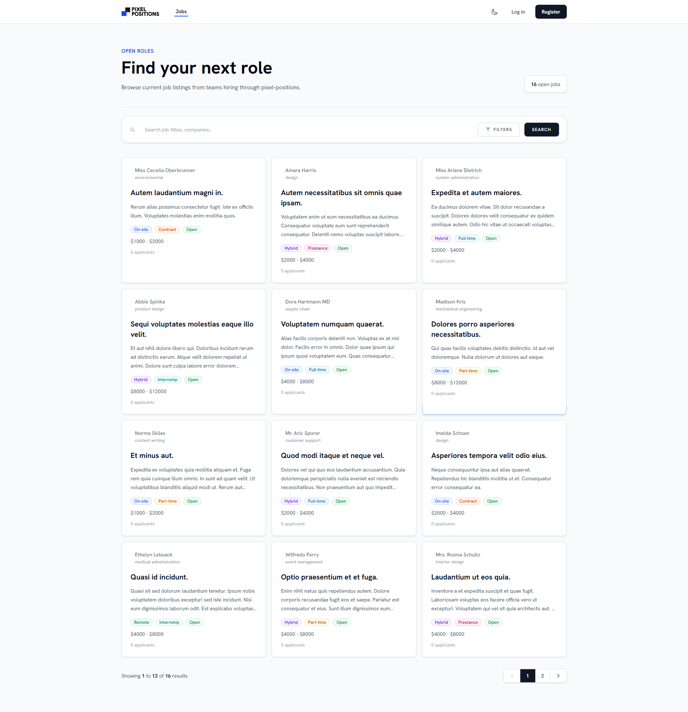
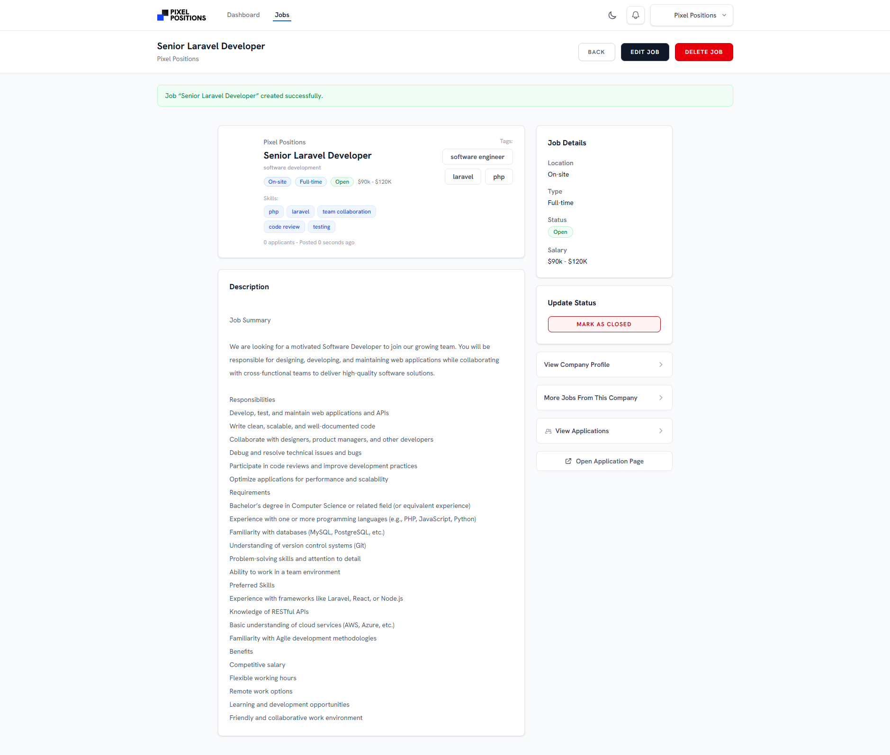
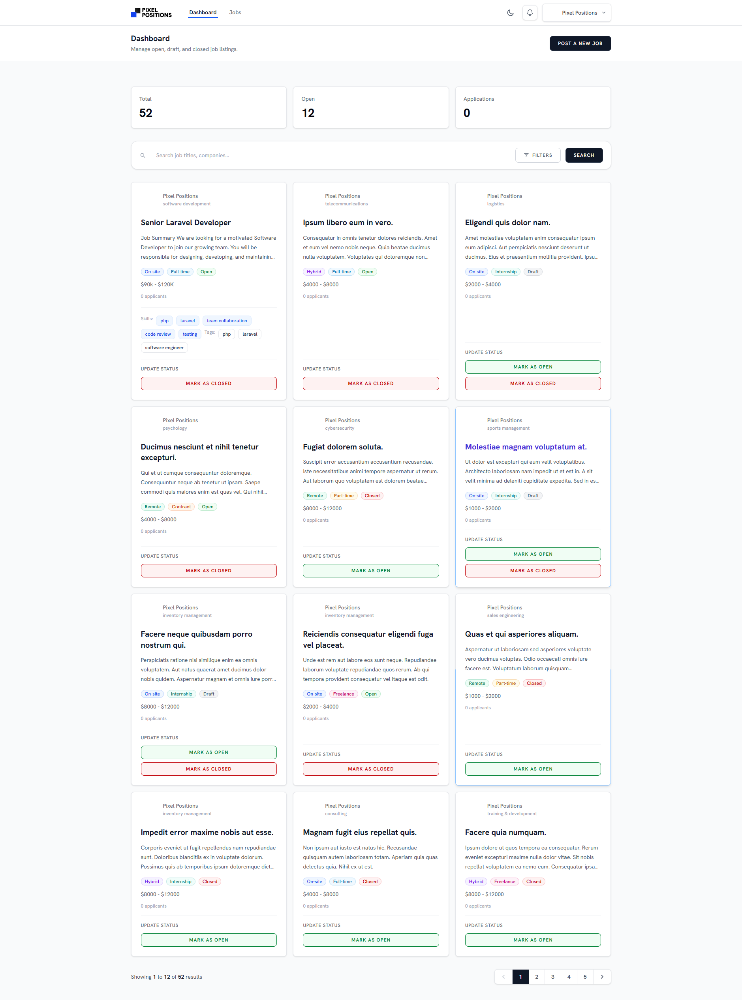
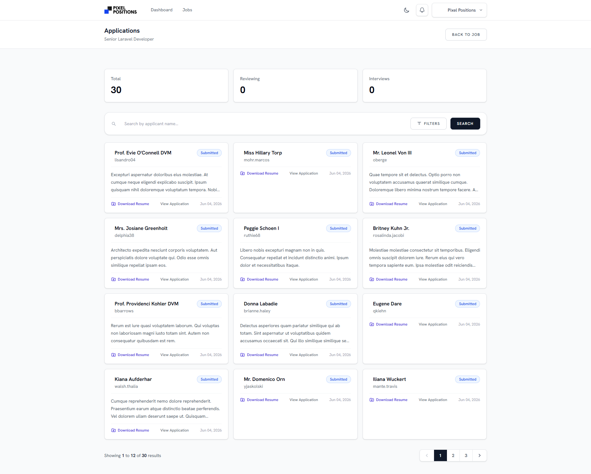
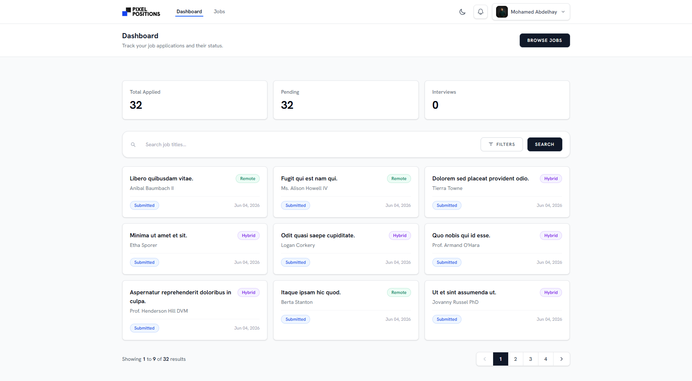
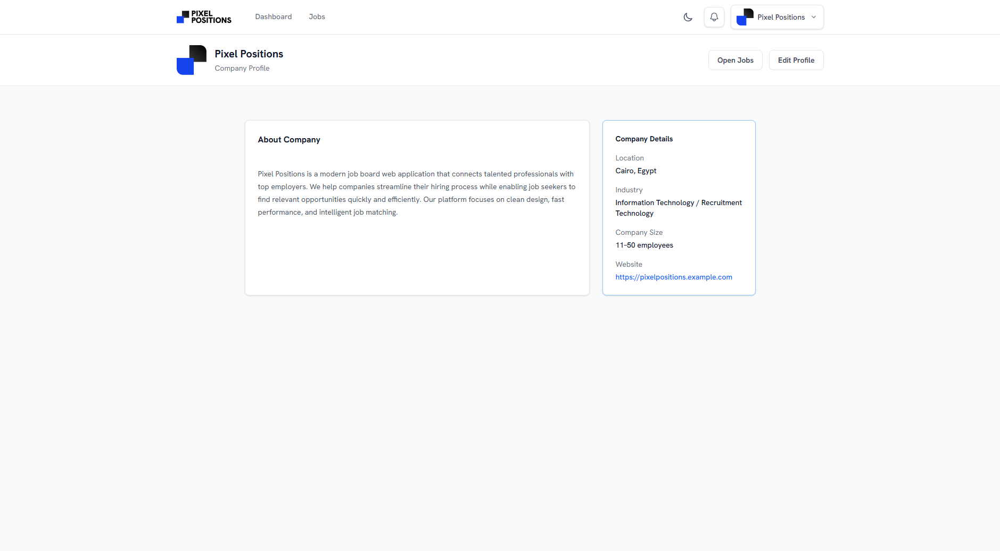
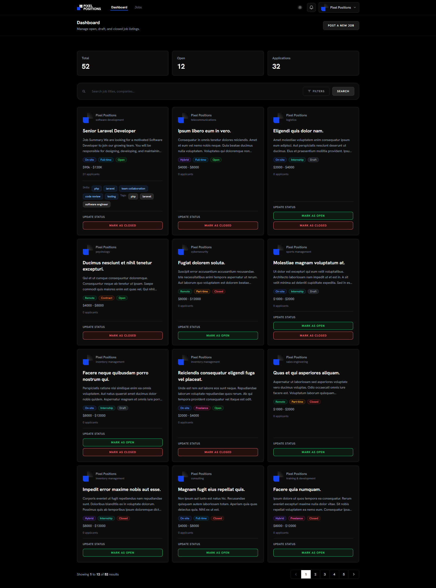

# Pixel Positions

A modern job-board platform built with Laravel.


## Table of Contents

- [About the Project](#about-the-project)
- [Features](#features)
- [Tech Stack](#tech-stack)
- [Getting Started](#getting-started)
- [Learning Outcomes](#learning-outcomes)
- [Project Structure Highlights](#project-structure-highlights)
- [License](#license)

## About the Project

Pixel Positions is a full-featured job-board application built with Laravel 13. It provides a structured platform where employers can publish job listings and candidates can discover, filter, and apply to open roles.

The application supports two user roles: `employer` and `candidate`, stored as a backed enum in the `role` column. Employers manage job listings, move jobs through the Draft → Open → Closed workflow, and review incoming applications through a guarded application-status workflow.

Candidates can browse open jobs, filter listings, view detailed job pages, upload résumés, submit cover letters, and track application progress from their dashboard. Each job detail page includes a skill-match score calculated against the candidate's profile skills.

Pixel Positions also includes public profile pages, AJAX-powered search across key screens, queued email notifications, database notifications, and dark-mode support persisted in `localStorage`.

### Screenshots















## Features

### Employer

- Register / login as an employer with a company logo
- Create, edit, and delete job listings — title, description, location, type, salary range, skills, tags, category, and external URL
- Manage job status: Draft → Open → Closed — with transition guards
- View paginated applications per job with search & filters — applicant name, status, and date range
- Update application status through a defined workflow — Submitted → Reviewing → Interview → Hired / Rejected
- Download candidate résumés
- View candidate profiles — only for candidates who applied to own jobs
- Public company profile page

### Candidate

- Register / login as a candidate with a profile photo
- Browse and search / filter all open job listings — keyword, job type, and location
- View detailed job page with skills-match score against own profile
- Apply to jobs: upload résumé — PDF/DOCX — plus optional cover letter
- Dashboard with paginated application history, filterable by status, type, and location
- Receive in-app and email notifications on status changes
- Manage candidate profile: headline, bio, work experience, education, location, availability, and portfolio URL
- Manage skills — up to 15, with autocomplete token-picker

### General

- Dark-mode toggle — persisted in `localStorage`
- AJAX search / filter on four pages — no page reload
- Queued emails for all application events
- Responsive layout — Tailwind CSS v4
- Email verification flow — Laravel Breeze

## Tech Stack

| Layer | Technology | Notes |
| --- | --- | --- |
| Backend Framework | Laravel 13 | PHP ^8.3 |
| Auth Scaffolding | Laravel Breeze | Blade stack |
| Frontend | Alpine.js 3 + Tailwind CSS v4 | Bundled with Vite 8 |
| Database | MySQL 8.4 (Sail) / SQLite (tests) | — |
| Cache / Queue | Redis (Sail) | Database driver fallback |
| File Storage | Local disk (résumés) + Public disk (logos/images) | — |
| Image Processing | Intervention Image v4 (GD) | Stored as WebP |
| Search | Custom `searchLike()` helper + Eloquent `when()` | — |
| Mail dev server | Mailpit (Sail) | — |
| Testing | Pest 4 + pest-plugin-laravel | In-memory SQLite |
| Code Style | Laravel Pint | PSR-12 |

## Getting Started

### Prerequisites

- Docker Desktop — for Sail
- Node.js ≥ 20 + npm

### Installation

1. Clone the repository

```bash
git clone <repository-url> pixel-positions
cd pixel-positions
```

2. Copy the environment file

```bash
cp .env.example .env
```

3. Install PHP dependencies — without Sail running yet, using the composer Docker trick

```bash
docker run --rm \
    -u "$(id -u):$(id -g)" \
    -v "$(pwd):/var/www/html" \
    -w /var/www/html \
    laravelsail/php83-composer:latest \
    composer install --ignore-platform-reqs
```

4. Start Sail

```bash
./vendor/bin/sail up -d
```

5. Generate application key

```bash
./vendor/bin/sail artisan key:generate
```

6. Run migrations and seed the database

```bash
./vendor/bin/sail artisan migrate --seed
```

7. Install Node dependencies and build assets

```bash
./vendor/bin/sail npm install
./vendor/bin/sail npm run build
```

8. Create the storage symlink

```bash
./vendor/bin/sail artisan storage:link
```

9. Start the queue worker — needed for emails/notifications

```bash
./vendor/bin/sail artisan queue:listen
```

10. Visit `http://localhost` in your browser.

### Development Mode

```bash
composer run dev
```

The `dev` script runs the queue worker, Pail log viewer, and Vite development server concurrently for a complete local development workflow.

### Running Tests

```bash
./vendor/bin/sail artisan test
# or
./vendor/bin/sail php vendor/bin/pest
```

### Code Formatting

```bash
./vendor/bin/pint
```

## Learning Outcomes

This project was built to practice and deepen understanding of the following Laravel features and ecosystem tools:

### Laravel Migrations

Pixel Positions uses a multi-step migration history that models a real application as it evolves over time. The schema includes UUID columns for route model binding, enum defaults that were changed with `doctrine/dbal`, pivot tables for `job_skill`, `user_skill`, and `job_tag`, an `application_status_logs` audit table, and Laravel's `notifications` table.

The migration order also covers framework infrastructure tables such as sessions, cache, queue jobs, batches, and failed jobs. This makes the database layer representative of a production Laravel application rather than a simple CRUD prototype.

### Model Relationships

The domain model practices common Eloquent relationships including `HasMany`, `BelongsTo`, and `BelongsToMany` for skills and tags. Applications also expose a `HasOneThrough` relationship to reach the employer through the related `JobListing`.

The project uses custom `syncSkills()` and `syncTags()` methods to keep many-to-many relationships clean when job listings or candidate profiles are updated. These methods centralize relationship-syncing behavior so controllers can stay focused on request flow and authorization.

### Laravel Sail

Laravel Sail provides the Docker-based development environment for the project. The `compose.yaml` stack includes MySQL 8.4, Redis, Meilisearch, and Mailpit alongside the application service.

The normal workflow uses `./vendor/bin/sail up -d` to start the containers, then runs Artisan, npm, migrations, tests, and queue commands through Sail. This keeps the local environment consistent across machines while still feeling close to a standard Laravel workflow.

### Laravel Breeze

Pixel Positions uses Laravel Breeze with the Blade stack for authentication scaffolding. Breeze provides the core registration, login, password reset, password confirmation, and email verification flows.

The default registration flow was extended with a custom `RegisterUserRequest` and additional fields such as role, username, and logo. This allowed the project to keep Breeze's simple foundation while adapting it to the employer/candidate onboarding model.

### Laravel Policies

Authorization is organized through five policy classes: `JobListingPolicy`, `ApplicationPolicy`, `CandidatePolicy`, `EmployerPolicy`, and the related Gate definitions registered in `AppServiceProvider`. The string-based gates cover flows such as viewing candidate profiles only when an employer has a valid application relationship.

Controllers use `Gate::authorize()` to protect sensitive actions, while Blade templates use `@can` directives to conditionally show role-specific UI. This keeps access rules close to Laravel's authorization layer instead of scattering role checks throughout views and controllers.

### Laravel Notifications & Mailables

The `ApplicationStatusUpdated` notification sends both database and email notifications and is queued with `ShouldQueue`. This supports responsive application workflows while allowing email delivery to happen asynchronously.

The project also includes two queued Mailables: `ApplicationSubmittedToCandidate` and `NewApplicationForEmployer`. `NotificationViewResolver` maps notification classes to Blade partials, and the notification bell component presents database notifications inside the UI.

### Feature & Unit Tests with Pest

The test suite uses Pest 4 with pest-plugin-laravel and includes 14 feature test files: `ApplicationTest`, `Auth/AuthenticationTest`, `Auth/EmailVerificationTest`, `Auth/PasswordConfirmationTest`, `Auth/PasswordResetTest`, `Auth/PasswordUpdateTest`, `Auth/RegistrationTest`, `DashboardTest`, `ExampleTest`, `HelperFunctionsTest`, `JobListingTest`, `NotificationTest`, `ProfileTest`, and `UserProfileResourceTest`.

Tests use Pest patterns such as `describe()`, `it()`, and `beforeEach()`, along with Laravel's `RefreshDatabase` trait. The suite also uses helpers and fakes such as `fakeStorage()`, `Mail::fake()`, `Notification::fake()`, and `Storage::fake()`, with an in-memory SQLite database configured in `phpunit.xml`.

### Code Formatting with Pint

All PHP files in the project are formatted with Laravel Pint using the default Laravel preset, which is based on PSR-12. Pint keeps formatting consistent across controllers, models, policies, services, tests, and support classes.

Run the formatter with:

```bash
./vendor/bin/pint
```

## Project Structure Highlights

```text
app/
├── Enums/                         — five backed PHP enums with label(), color(), canTransitionTo()
├── Services/                      — JobListingService, Dashboard*, ImageOptimizationService
├── Support/                       — NotificationViewResolver
└── Helpers/
    └── helpers.php                — global helper functions

resources/
├── js/                            — ajax-search.js, token-picker.js, notifications.js, dark.js
└── views/
    └── components/                — reusable Blade components such as multi-select and token-picker
```

## License

This project is licensed under the [MIT License](LICENSE).
